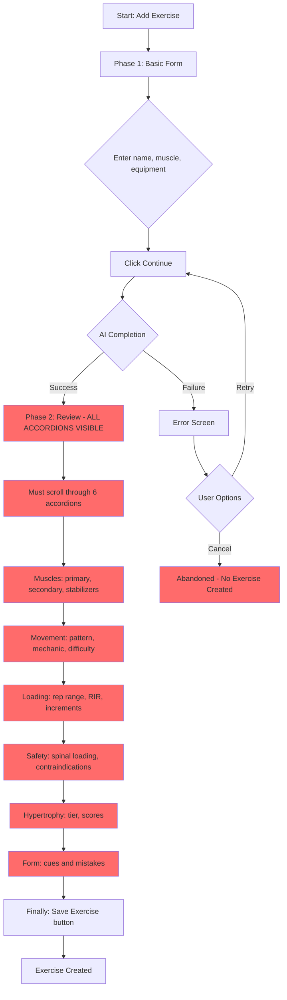
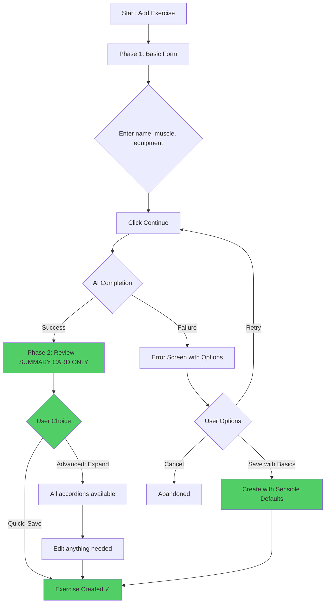

# Custom Exercise Creation - Flow Diagrams

## Current Flow (BEFORE)



**Problems:**
- 🔴 Long path: 9+ steps from review to save
- 🔴 Forced viewing: All accordions visible, requires scrolling
- 🔴 Dead-end: AI failure blocks creation entirely
- 🔴 Time: 5-8 minutes typical

---

## New Flow (AFTER)



**Improvements:**
- 🟢 Fast path: 1 step from review to save
- 🟢 Optional depth: Advanced details behind opt-in toggle
- 🟢 Fallback: "Save with basics" when AI fails
- 🟢 Time: 30-60 seconds typical

---

## Side-by-Side Comparison

### Phase 2: Review Screen

#### BEFORE (Complex)
```
┌─────────────────────────────────────────┐
│         You're all set                  │
│  AI filled in the details below...      │
└─────────────────────────────────────────┘

┌─────────────────────────────────────────┐
│ Exercise Name: Seated Cable Row         │
│ Equipment: Cable                        │
└─────────────────────────────────────────┘

▼ Muscles ━━━━━━━━━━━━━━━━━━━━━━━━━━━━━━━
│ Primary: Lats                           │
│ Secondary: [Edit button]                │
│   - Middle traps                        │
│   - Rear delts                          │
│ Stabilizers: [Edit button]              │
│   - Core                                │
│   - Biceps                              │
└─────────────────────────────────────────┘

▼ Movement Properties ━━━━━━━━━━━━━━━━━━━
│ Pattern: Horizontal Pull                │
│ Mechanic: Compound                      │
│ Difficulty: Intermediate                │
│ Fatigue Rating: Medium (2/3)            │
└─────────────────────────────────────────┘

▼ Loading & Progression ━━━━━━━━━━━━━━━━
│ Rep Range: 8 to 12                      │
│ Default RIR: 2                          │
│ Min Weight Increment: 2.5 kg            │
└─────────────────────────────────────────┘

▼ Safety & Injury ━━━━━━━━━━━━━━━━━━━━━━
│ Spinal Loading: Low                     │
│ ☑ Requires back arch                    │
│ Position Stress:                        │
│   ☑ Lower Back  ☐ Shoulders             │
│ Contraindications: [None]               │
└─────────────────────────────────────────┘

▼ Hypertrophy Rating ━━━━━━━━━━━━━━━━━━━
│ Overall Tier: A-Tier                    │
│ Stretch Under Load: ████░ 4/5           │
│ Resistance Profile: ████░ 4/5           │
│ Progression Ease: █████ 5/5             │
└─────────────────────────────────────────┘

▼ Form Cues ━━━━━━━━━━━━━━━━━━━━━━━━━━━━
│ • Sit upright, chest up                 │
│ • Pull to lower chest                   │
│ • Squeeze shoulder blades               │
│ • Control the negative                  │
│ [Edit cues]                             │
└─────────────────────────────────────────┘

[Back]          [Save Exercise]

USER MUST SCROLL ↓ THROUGH ALL THIS
```

#### AFTER (Simple)
```
┌─────────────────────────────────────────┐
│         Ready to save                   │
│  AI completed the exercise details.     │
│  Review the summary and save, or        │
│  adjust details if needed.              │
└─────────────────────────────────────────┘

┌─────────────────────────────────────────┐
│ Exercise Name                           │
│ Seated Cable Row                        │
│                                         │
│ Equipment: Cable                        │
└─────────────────────────────────────────┘

┌──────────────┬──────────────┬──────────┐
│ Primary      │ Type         │ Rep      │
│ muscle       │              │ range    │
│ Lats         │ Compound     │ 8-12     │
└──────────────┴──────────────┴──────────┘
┌──────────────┬──────────────┬──────────┐
│ Hypertrophy  │ Difficulty   │          │
│ A-tier       │ Intermediate │          │
└──────────────┴──────────────┴──────────┘

┌─────────────────────────────────────────┐
│ ▼ Adjust advanced details (optional)    │
└─────────────────────────────────────────┘
       ↑
       All the accordions are HERE
       but COLLAPSED by default
       
[Back]          [Save Exercise] ← PRIMARY CTA

USER CAN SAVE IMMEDIATELY ✓
```

---

## Error Handling Flow

### AI Failure Scenario

#### BEFORE
```
┌─────────────────────────────────────────┐
│ ⚠ AI limit reached                      │
│                                         │
│ Unable to complete exercise metadata.   │
│                                         │
│ [Back]                    [Retry]       │
└─────────────────────────────────────────┘

❌ User is STUCK
   - Must retry (might fail again)
   - Or abandon entirely
   - Cannot proceed with creation
```

#### AFTER
```
┌─────────────────────────────────────────┐
│ ⚠ AI limit reached                      │
│                                         │
│ Unable to complete exercise metadata.   │
│                                         │
│ ┌───────────────────────────────────┐   │
│ │  Retry AI completion              │   │
│ └───────────────────────────────────┘   │
│ ┌───────────────────────────────────┐   │
│ │  Save with basics only       [NEW]│   │
│ └───────────────────────────────────┘   │
└─────────────────────────────────────────┘

✅ User has OPTIONS
   - Retry if they want
   - OR save with defaults now
   - Can enrich metadata later
```

---

## Mid-Workout Flow

### From Active Workout Session

```mermaid
graph LR
    A[Active Workout] --> B[Click + Add Exercise]
    B --> C[Add Exercise Picker]
    C --> D[Click Create Custom Exercise]
    D --> E[Custom Exercise Modal]
    E --> F[Complete Creation]
    F --> G{Success}
    G -->|Yes| H[handleCustomExerciseSuccess]
    H --> I[Fetch Exercise]
    I --> J[Add to Workout via handleAddExercise]
    J --> K[Close Both Modals]
    K --> L[Back to Workout with Exercise Added]
    
    style H fill:#51cf66
    style I fill:#51cf66
    style J fill:#51cf66
    style K fill:#51cf66
    style L fill:#51cf66
```



**Status:** ✅ Already working correctly  
**Verification:** Code review confirmed proper flow exists

---

## Time Comparison

### Average Time to Create Custom Exercise

```
BEFORE (Complex Path):
Phase 1: Basic Info        →  1 min
Wait for AI               →  15 sec
Phase 2: Review ALL       →  5-8 min
  - Read muscles          →  30 sec
  - Check movement        →  30 sec
  - Review loading        →  30 sec
  - Check safety          →  1 min
  - Review hypertrophy    →  1 min
  - Read form cues        →  1 min
  - Scroll to save        →  15 sec
Save                      →  5 sec
━━━━━━━━━━━━━━━━━━━━━━━━━━━━━━━━━
TOTAL: 7-10 minutes

AFTER (Fast Path):
Phase 1: Basic Info        →  1 min
Wait for AI               →  15 sec
Phase 2: Glance at summary →  10 sec
Save                      →  5 sec
━━━━━━━━━━━━━━━━━━━━━━━━━━━━━━━━━
TOTAL: 1.5 minutes

AFTER (AI Fails):
Phase 1: Basic Info        →  1 min
AI fails                  →  0 sec
Save with basics          →  5 sec
━━━━━━━━━━━━━━━━━━━━━━━━━━━━━━━━━
TOTAL: 1 minute

━━━━━━━━━━━━━━━━━━━━━━━━━━━━━━━━━
IMPROVEMENT: 80-90% faster
```

---

## User Experience Metrics

### Before
- ⏱️ **Time:** 7-10 minutes average
- 📊 **Steps:** 9+ interactions from review to save
- 🔴 **Friction:** High - mandatory expert screens
- ❌ **Failure mode:** Dead-end (no fallback)
- 👤 **Audience:** Power users only

### After
- ⏱️ **Time:** 1-2 minutes average
- 📊 **Steps:** 2 interactions (glance + save)
- 🟢 **Friction:** Low - summary card → save
- ✅ **Failure mode:** Fallback available
- 👤 **Audience:** All users (progressive disclosure)

### Key Wins
1. **90% time reduction** for typical case
2. **Progressive disclosure** - simple default, power available
3. **Failure recovery** - AI problems don't block users
4. **No feature loss** - all advanced controls preserved
